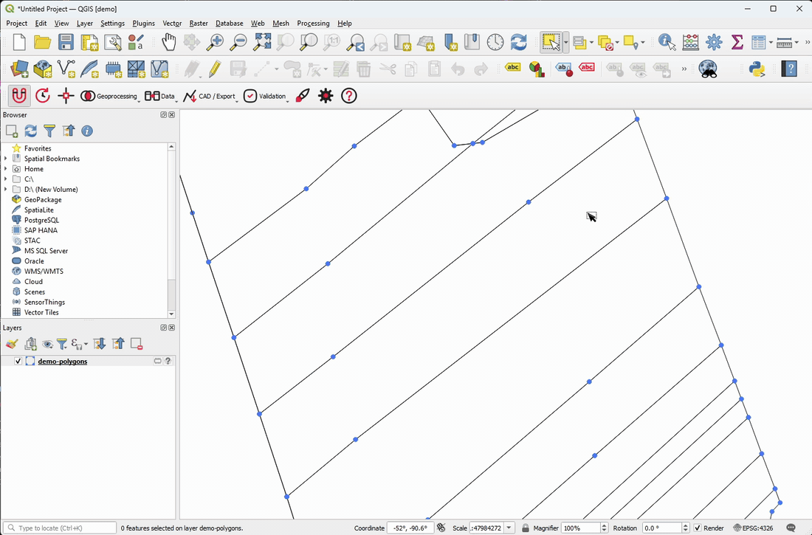
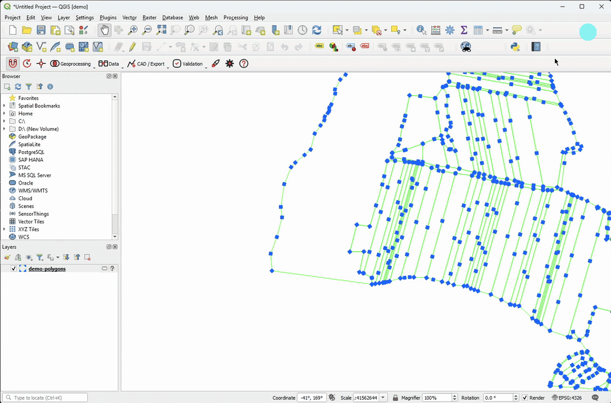
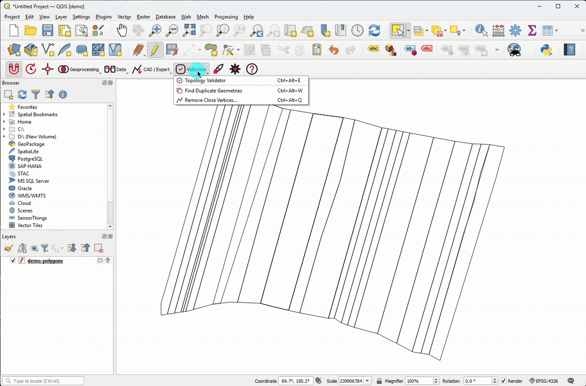
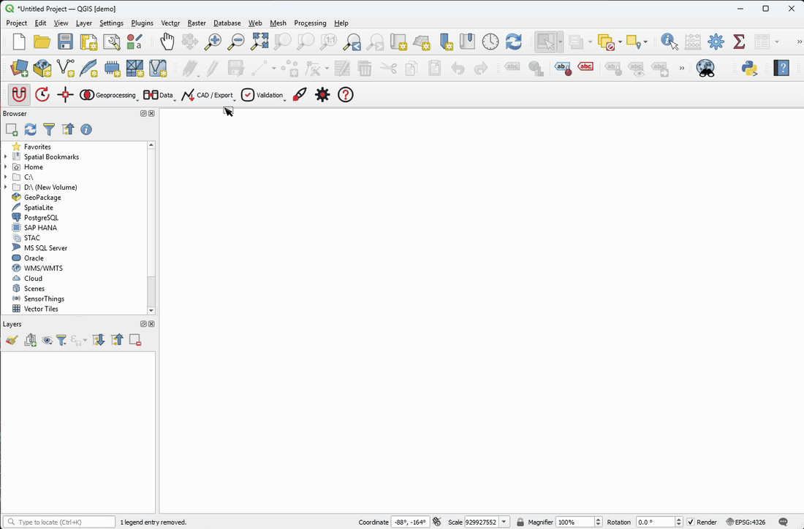
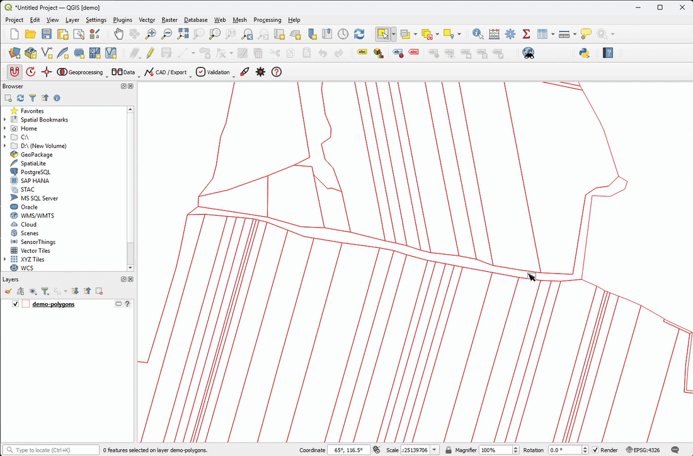

# Vernier

[](https://github.com/ryxlabs/vernier/actions/workflows/tests.yml)

**Vector editing toolkit for QGIS.**

Vernier bundles a CAD-style canvas and command bar, topology validation with styled error layers, polygon splitting to exact target areas, centerline extraction, DXF/DWG and KMZ exchange, and versioned autosave backups into a single toolbar. The core tools run on stock QGIS and need nothing else installed.

## In Action

**Split to Target Areas.** You draw a direction line and type the areas you need, and
each piece is cut to exactly that size. Whatever is left over is tracked as the
remainder.

<p align="center"></p>

**CAD Mode.** The command bar accepts the commands you already use in other CAD
software: `pl` draws a polyline, `cp` copies, `mv` moves. Every tool in the plugin
answers to a command of its own as well, listed in the [table below](#tools), and
autocomplete fills in the ones you only half remember. The mode also switches the
canvas to a dark theme with a scalable grid and adds a status strip.

<p align="center"></p>

**Topology Validator.** Each error appears as a clickable row that zooms the canvas to
the geometry, and each kind of error becomes its own styled layer, so you locate the
problem and fix it in one pass.

<p align="center"></p>

**DXF/DWG Import.** Each CAD layer becomes its own QGIS layer, drawn in the colors the
entities render with rather than the ones the layer table declares.

<p align="center"></p>

**Centerline Extraction.** The tool computes the medial axis of a polygon, keeps the
main trunk and straightens it, which suits parcels, roads and rivers.

<p align="center"></p>

## Tools

Every tool can be run from the toolbar, from the menu, or by typing its command in the
CAD Mode command bar.

| Tool | Command | What it adds over core QGIS |
|---|---|---|
| CAD Mode | `cad` | Follows the workspace conventions of AutoCAD, BricsCAD, ZWCAD, GstarCAD, DraftSight and other DWG/DXF software. It adds a typed command bar with autocomplete, a dark canvas with a scalable grid, and a status strip carrying F2/F4/F9 toggles and an F8 basemap toggle. The editing commands are built in, among them `pl`, `cp`, `mv`, `ro`, `del`, `ve`, `sel` and `di`. Off by default. |
| Smart Snapping | `snap`, `sn` | Applies a whole snapping profile in one click, covering all layers, vertex and segment snapping, intersections and topological editing. Core QGIS spreads the same settings across five separate toolbar buttons. |
| Autosave Backups | `autosave`, `backup` | Writes timestamped copies of the project and of any edited layers beside the originals, deletes the oldest once a retention limit is reached, and restores any of them from a browser dialog. |
| Find Duplicate Geometries | `duplicates`, `dup` | Extracts every member of each duplicate group into a review layer, so you can look at them before deleting anything. |
| Remove Close Vertices | `clean`, `cv` | Drops vertices that fall closer together than a tolerance, but keeps any vertex shared with a neighboring feature, so common boundaries survive. |
| Centerline Extraction | `centerline`, `cl` | Computes the medial axis of a polygon, then extracts the main trunk and straightens it. |
| Attribute / Spatial Join | `join`, `sjoin` | Joins several source layers in one pass, previews how many records match before anything is written, applies a policy you choose when one key matches several rows, and records which source each value came from. |
| KMZ Export | `kmz` | Writes several layers into one KMZ with label placemarks and per-layer colors. It remembers the label prefix and suffix for each field and shares them with the DXF export. |
| Area Readout | — | Shows the ellipsoidal area of the selected polygons in the status bar and updates it as the selection changes. You choose the units. |
| Geoprocessing Shortcuts | `bf`, `int`, `diff`, `dis`, `m2s` | Runs buffer, intersection, difference, dissolve and multipart-to-single directly, without opening the Processing toolbox. |
| Topology Validator | `topology`, `topo` | Checks for invalid geometries, duplicates, overlaps, gaps and vertex errors. Each result is a row you can click to zoom to the geometry, and each kind of error becomes a styled layer carrying the error details as attributes. |
| DXF/DWG Import | `dxfin` | Reads drawings produced by any DWG/DXF package, including AutoCAD, BricsCAD, ZWCAD and GstarCAD, and any DWG version by way of ODA. It creates one styled layer per CAD layer and reproduces the colors the entities render with, resolving BYLAYER, BYBLOCK, per-entity ACI and 24-bit true color, along with lineweights and linetypes. |
| DXF Export | `dxfout` | Writes labels as TEXT entities in their true colors, places each label point inside its polygon and rotates it to the part's main axis, emits a per-layer style table, and can split by attribute into one DXF per value. |
| CAD Lines to Polygons | `polygonize`, `l2p` | Builds polygon layers from closed CAD lines, producing one output layer for each value of the drawing's `Layer` attribute. |
| Quick Symbology | `style`, `sym` | Applies a saved template covering line style, vertex markers and multi-field labels. Each label slot is filled by the first field whose name matches it, and the tool reports any slot it could not fill. |
| Split to Target Areas | `split`, `spl` | Splits one polygon into pieces of exact areas along a direction line you draw. You can paste the target areas from Excel, watch the remainder as you go, and switch to a millimeter grid. |

## Installation

In QGIS, open *Plugins > Manage and Install Plugins* and search for **Vernier**.

To install from source:

```bash
cd <your QGIS profile>/python/plugins
git clone https://github.com/ryxlabs/vernier vernier
```

Then enable it in *Plugins > Manage and Install Plugins > Installed*.

## Requirements

- QGIS 3.28 or newer, including QGIS 4. Both Qt5 and Qt6 builds are supported.
- The core tools have no external dependencies and run on a stock QGIS.

Some tools need something extra:

| Tool | Needs | How to get it |
|---|---|---|
| DXF import / export | `ezdxf` (Python) | The plugin can install it for you, into a private folder inside your QGIS user profile so that it survives plugin updates. It asks before doing so and leaves the QGIS installation untouched. To install it yourself, run `python -m pip install ezdxf` from the OSGeo4W Shell on Windows, or from your system Python on Linux and macOS. |
| Centerline extraction | `shapely` (Python) | Ships with QGIS, so there is nothing to install. |
| **DWG** import (not DXF) | [ODA File Converter](https://www.opendesign.com/guestfiles/oda_file_converter) | Free, and you install it yourself. The plugin looks for it on disk and lets you point at it if it sits somewhere unusual. It never downloads anything. |

## Folder Structure

```
vernier/
├── vernier.py         # plugin class; actions built from features.py
├── features.py        # declarative feature catalog (toolbar/menu/help)
├── command_bar.py     # CAD Mode: command bar, registry and status strip
├── cad_grid.py        # CAD Mode: scalable grid overlay for the canvas
├── detach_panel.py    # Split to Target Areas dock panel
├── topology_panel.py  # Topology Validator dock panel
├── i18n.py            # one translation context for the whole plugin
├── qt_compat.py       # field-type constants for Qt5 and Qt6 builds
├── dialogs/           # dialog windows (inherit BaseDialog)
├── services/          # business logic, one service per tool
├── tools/             # canvas tools and small per-tool helpers
├── icons/             # light-theme icons (see ATTRIBUTION.md)
│   └── dark/          # dark-theme icons (generated - do not edit)
└── test/              # per-module suites (see test/README.md)
```

## Development

Tests run with QGIS's bundled Python, one process per module. See
[test/README.md](test/README.md) for the exact commands on Windows and Linux. CI runs
the whole suite on QGIS 3.28, 3.34 LTR and latest on every push.

Releases are packaged as `dist/vernier.<version>.zip` and uploaded to the QGIS plugin
repository.

## Support

Bug reports and feature requests are welcome on the [issue tracker](https://github.com/ryxlabs/vernier/issues). For commercial support or custom development, write to hello@ryxlabs.dev.

## License

GNU General Public License v2 or later (`GPL-2.0-or-later`), the same license as QGIS
itself. See [LICENSE](LICENSE).

Some icons are adapted from [Tabler Icons](https://tabler.io/icons) (MIT) - see
[icons/ATTRIBUTION.md](icons/ATTRIBUTION.md).

Copyright © 2026 RYXLAB SOFT TECH SRL ([RyxLabs](https://ryxlabs.dev))
